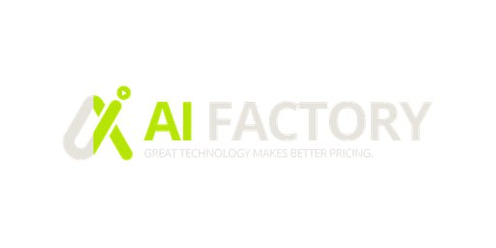

<p align="center">
  
</p>

# waoowaoo AI 影视 Studio

> ⚠️ **测试版声明**：本项目目前处于测试初期阶段，由于暂时只有我一个人开发，存在部分bug 和不完善之处。我们正在快速迭代更新中，会不断完善功能及效果，欢迎提交 Issue 反馈问题！
> 欢迎加入微信交流群获得最新消息，或提出你想要的功能，我们会尽可能实现


一款基于 AI 技术的短剧/漫画视频制作工具，支持从小说文本自动生成分镜、角色、场景，并制作成完整视频。

## ✨ 功能特性

- 🎬 **AI 剧本分析** - 自动解析小说，提取角色、场景、剧情
- 🎨 **角色 & 场景生成** - AI 生成一致性人物和场景图片
- 📽️ **分镜视频制作** - 自动生成分镜头并合成视频
- 🎙️ **AI 配音** - 多角色语音合成
- 🌐 **多语言支持** - 中文/英文界面（英文提示词预计下个版本增加）

## 🚀 快速开始

### 1. 克隆项目

```bash
git clone https://github.com/saturndec/waoowaoo.git
cd waoowaoo
```

### 2. 安装依赖

```bash
npm install
```

### 3. 初始化数据库

```bash
npx prisma generate
npx prisma db push
```

### 4. 编译并启动

```bash
npm run build
npm run start
```

访问 http://localhost:3000 开始使用！


## 📦 技术栈

- **框架**: Next.js 15 + React 19
- **数据库**: SQLite (Prisma ORM)
- **样式**: Tailwind CSS v4
- **认证**: NextAuth.js

## 🔧 API 配置

启动后进入 **设置中心** 配置 AI 服务的 API Key，内置配置教程。

> 💡 **推荐配置**：目前只测试过字节火山引擎（Seedance、Seedream）和 Google AI Studio（Banana）的效果，其他模型暂不推荐配置。

> 📝 **文本模型**：目前只支持 OpenRouter API，后续会增加更多格式支持。

## 🤝 反馈

本项目由 waoowaoo 团队维护，暂不接受 Pull Request。如有问题或建议，欢迎提交 Issue！

---

**Made with ❤️ by waoowaoo team**
